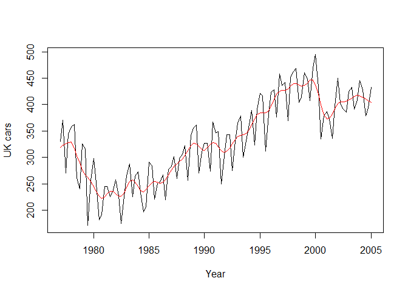

# MSDS6306LiveUnit11
Yanqin Wang  
November 15, 2016  

### 1. Load data ukcars into R and plot the data to identify seasonal fluctuations and/or a trend.
### First install the package called "fpp" if not installed. install.packages("fpp")

```r
library(fpp)
```

```
## Loading required package: forecast
```

```
## Loading required package: zoo
```

```
## 
## Attaching package: 'zoo'
```

```
## The following objects are masked from 'package:base':
## 
##     as.Date, as.Date.numeric
```

```
## Loading required package: timeDate
```

```
## This is forecast 7.3
```

```
## Loading required package: fma
```

```
## Loading required package: tseries
```

```
## Loading required package: expsmooth
```

```
## Loading required package: lmtest
```

```r
data(ukcars)
plot(ukcars)
```

<!-- -->

### Based on the plot, this data has a clear increasing tread and seasonal fluctuations.

### 2.Use a classical decomposition to calculate the trend-cycle and seasonal indices. 

```r
fitd <- decompose(ukcars)
plot(fitd)
```

<!-- -->

```r
str(fitd)
```

```
## List of 6
##  $ x       : Time-Series [1:113] from 1977 to 2005: 330 371 271 344 358 ...
##  $ seasonal: Time-Series [1:113] from 1977 to 2005: 26.08 20.16 -45.12 -1.12 26.08 ...
##  $ trend   : Time-Series [1:113] from 1977 to 2005: NA NA 333 335 333 ...
##  $ random  : Time-Series [1:113] from 1977 to 2005: NA NA -16.72 10.01 -0.38 ...
##  $ figure  : num [1:4] 26.08 20.16 -45.12 -1.12
##  $ type    : chr "additive"
##  - attr(*, "class")= chr "decomposed.ts"
```

```r
head(fitd$trend)
```

```
## [1]       NA       NA 332.5080 334.9944 332.7921 318.6779
```

```r
head(fitd$seasonal)
```

```
## [1]  26.078380  20.160732 -45.118387  -1.120726  26.078380  20.160732
```

### The results are in agreement with the graphical interpretation from above plots.

### 3. Compute and plot the seasonally adjusted data.

```r
caradj <- seasadj(fitd)
plot(caradj)
```

<!-- -->

### 4. Change one observation to be an outlier (e.g., add 500 to one observation), and recompute the seasonally adjusted data. What is the effect of the outlier?

```r
# add an outliner in position 55, the middle of the data.
ukcars2 <-
  ts(c(ukcars[1:54],ukcars[55]+500,ukcars[56:113]
  ),start=c(1977,1),frequency=4)
fitd2 <- decompose(ukcars2)
caradj2 <- seasadj(fitd2)
plot(caradj2)
```

<!-- -->

### Compared to the plot in part3, the outliner causes a big increase in the middle of the seasonally adjusted data, other parts remain the same.

### 5. Does it make any difference if the outlier is near the end rather than in the middle of the time series?

```r
#add an outlinernear the end of the data and recompute the data.
ukcars3 <-
  ts(c(ukcars[1:2],ukcars[3]+500,ukcars[4:113]
  ),start=c(1977,1),frequency=4)
fitd3 <- decompose(ukcars3)
caradj3 <- seasadj(fitd3)
plot(caradj3)
```

<!-- -->

### Compared to the plots in part3 and part4, both outliners have similar effect: cause a big increase in the loca region, no effect on other regions of the time series. 

### 6. Use STL to decompose the series.

```r
fit <- stl(ukcars, s.window=5)
head(fit$time.series)
```

```
##       seasonal    trend  remainder
## [1,]  28.24679 319.2830 -17.158822
## [2,]  44.06728 323.2938   3.689938
## [3,] -59.70575 326.1715   4.204199
## [4,] -14.12420 328.2577  29.746522
## [5,]  31.35906 328.9638  -1.831857
## [6,]  42.52229 317.2184   3.081322
```

```r
plot(ukcars, col="black",
     ylab="UK cars", xlab="Year")
lines(fit$time.series[,2],col="red"
      ,ylab="Trend")
```

<!-- -->

